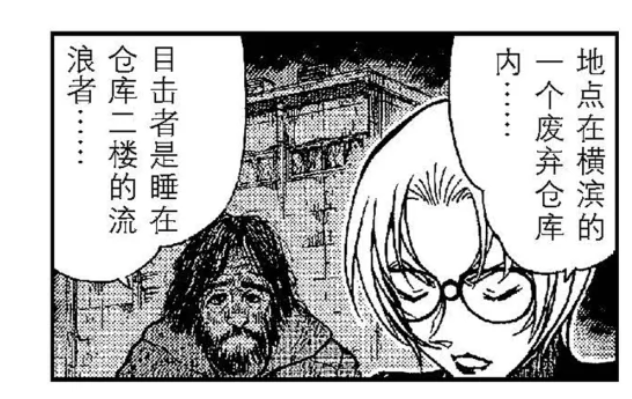
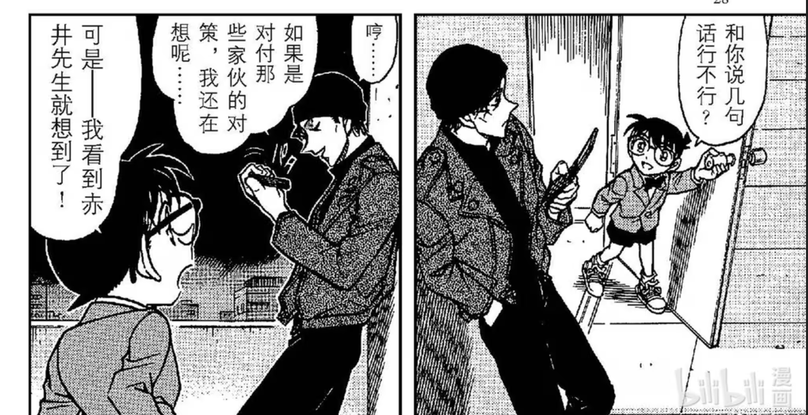
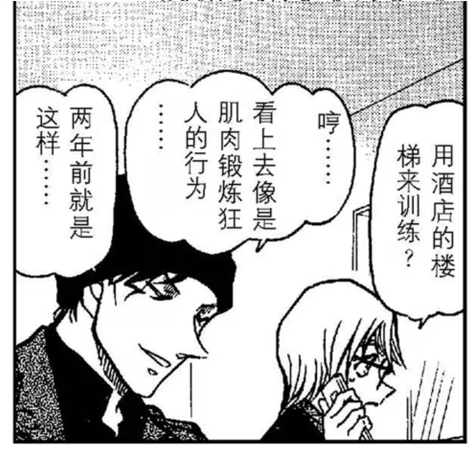
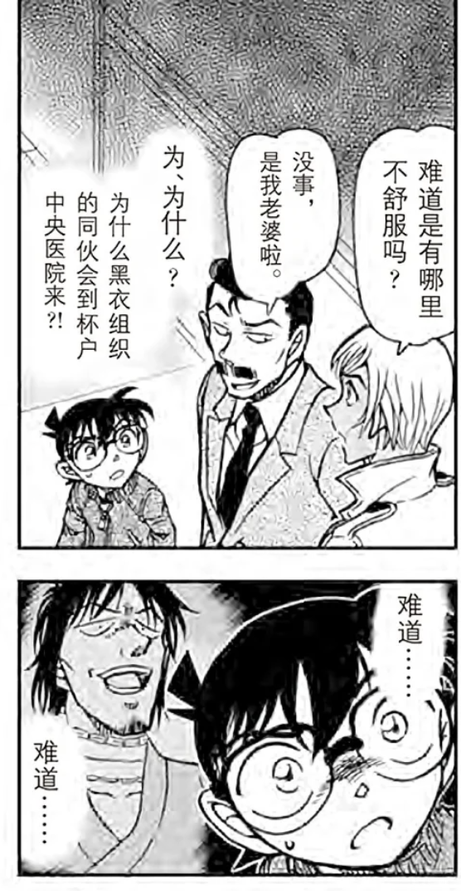
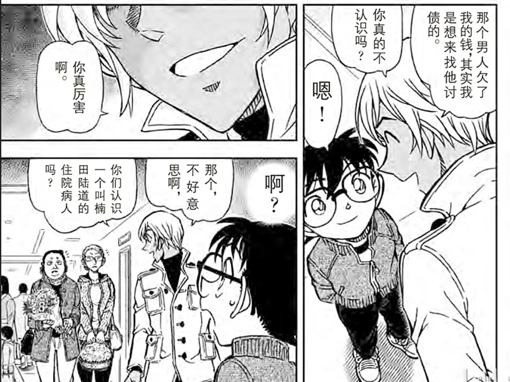
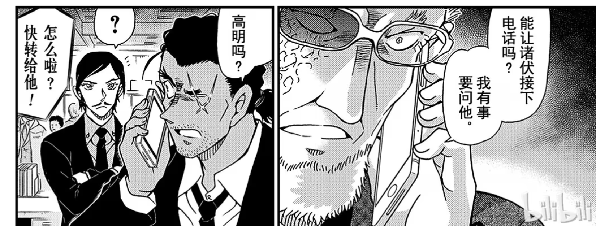

## 参考

[名侦探柯南/剧情年表 - 柯南百科 名侦探柯南档案馆](https://www.conanpedia.com/zh-hans/名侦探柯南/剧情年表)

关于安室身世73说过的话：
1.设定复杂
2.血缘关系严格保密
3.受家庭影响英语好
4.黑皮有原因

安室改公安是出场第二话决定的

### 红黑篇

595

水无爸爸就是在横滨的一个废弃仓库去世的，横滨有意义吗？说明横滨有组织和CIA的据点？

赤井获得了水无爸爸是CIA的情报，朱蒂说不知道他是用什么手段弄来的。这里在暗示赤井有fbi以外的势力？即使没有详尽的赤井一家设定，但父母都是特工，父亲与组织有仇的设定应该是有的，这些赤井都隐瞒着fbi。fbi认为赤井对抗组织的原因还是为女朋友报仇。

596

此时的秀一还不知道自己的未来……

“不会轻易吐露真相的院长”

詹姆斯认识院长是通过“洛杉矶的歹徒袭击” ，给院长安排了钩子啊，那么真的很可能不是普通的院长。

而且还专门提到是发邮件或者写信联系，连面都没见过，都不知道他当上大医院的院长了，你们怎么能有这么深的交情的？怎么知道他是不会轻易吐露真相的？

听到组织派人潜入医院里，其他人都是震惊，赤井邪魅一笑，还是特写，啥意思，他早就料到了吗？还是说觉得机会终于来了？

noc这个词咋了，有啥不对劲的？

597

为什么要阻止院长做脑电检查？詹黑不请自来！

哈哈 人前一套人后一套，结果其实你俩都不信任fbi

楠田陆道失联的消息传到组织那边，确认基尔在杯户中央医院，伏特加说接下来要转移基尔，琴酒说要用抢的，而且他“早就安排好了”，这个安排指什么？看后文就是指水无录像和炸弹吧。

那位大人忌惮银弹，原因不明

599

水无位置暴露（按照正常逻辑应该是通过楠田陆道失联），詹姆斯第一件事就是要去找院长，被秀一阻止，虽然之后补了很多正确的理由。赤井是不是有怀疑？

是真的没想到还是只是单纯想夸小孩顺便踩一脚fbiwww

朱蒂盖章秀一有点兴奋，假死计划是稍后月下谈话才说的，所以就是因为看透柯南不一般？

柯南竟然是从詹姆斯嘴里听到赤井的过去的，以及和宫野姐妹的关系。詹姆斯知道明美有个科学家妹妹。

明美短信，PS的内容是什么？

月下谈话

卡迈尔刚出场也像黑的，说是接妻子的电话，结果妻子是赤井么hhh

月下谈完就已经开始互夸了www

602

柯对着卡迈尔表情紧张，是因为送回水无的计划需要依赖卡迈尔的车技吗？秀一这意思是卡迈尔绝对可以信任？从后文来看的确是这样。所以这里柯南对秀一还其实是不能完全信任。

603

“那家伙” “那位大人以防万一的对策” 这里到底是指谁？是指贝尔摩德？从后文来看的确是贝尔摩德，说明琴酒非必要不使用贝尔摩德。

贝尔摩德是直接从boss那里接命令，跟踪赤井秀一，印证对赤井的忌惮。

605

水无回组织，贝姐意味深长

“什么样的fbi会认真考虑小孩子的方案呢？” 

606

卡迈尔被当成嫌疑人了。这里交待秀一两年前就认识卡迈尔，指的是仓库事件。是不是意味着朗姆这个角色此时就已经定好了，和詹姆斯同一时期。**所以詹姆斯和朗姆是同时设定的概率很大。**

朱蒂走之前，秀一特地和朱蒂道了别，说有不详的预感。所以秀一是意识到这是一个会被组织捕捉到的机会？

詹姆斯去车库找赤井也没说是什么事，所以这段就是为了不小心暴露了计划给詹姆斯，而且还露出了自信的微笑。

607

**重点来了，琴酒怎么知道FBI行踪，以及卡迈尔被卷入事件的？**

柯南给朱蒂打电话的时候在场的只有詹姆斯和秀一。

### 列车篇

795

安室透初登场，一上来就提到了间谍……但应该指酒厂间谍。

798

安室透登场紧接着的一个案子就是柯南绑架。从小兰口中得知阿笠博士的存在，还有发明道具。

800

看漫画才看明白，猫哥这里打开车门是准备掏枪，结果看到波本了所以收回。

所以赤井在这一幕才知道波本来接近小五郎他们了么，但好像没有表现出很强的戒心？因为猜到真实身份？

安室透以前见过世良，和苏格兰一起的时候，但世良不认识安室透。**这里说明安室透出场时和红方人物的关系就是设定好的，不存在什么黑改红一说。**

817

世良看到宫野救人的视频，发现灰原能变大。

当晚，波本去侦探事务所偷看视频，而猫哥黑进系统。

这张就是纯粹很可爱↓

### 绯色篇

825

列车篇后柯和哀坦白猫哥是自己人，连监控灰原的手机都告诉了。小哀已经捕捉到监控这个词，接下来会留意了吧？

827

就是单纯的很可爱^^

波本对贝姐也有所隐瞒，一开始是为了接近毛利，现在是为了接近柯南。

842

柯南在赌波本会来救人，是因为猜测他的立场？列车监听能得到的信息是波本认识灰原的妈妈，并且最终没有杀雪莉。

843

波本对柯南异常感兴趣，柯南是不是也在测试这一点呢？

柯南怎么关注点在横滨？横滨的蛋糕店有别的含义？

顺便记一下工藤家的地址

猫哥怎么知道快递是蛋糕？是因为窃听还是因为“横滨的蛋糕店”

850

赏花篇就提到公安警察了。

柯南不能理解波本为什么还要假扮赤井，柯导失算的是赤井和波本有私人恩怨没按剧本走……

856

柯南从高木那里推出那对夫妇是贝尔摩德和波本，打电话给灰原。波本跟踪柯南，可能听到了电话内容但不知道是打给谁？哦对了，他应该会怀疑是赤井。波本窃听成功的话应该已经知道柯南和组织扯上关系了，朱蒂提到了是柯南发来的录像带和他们的间谍，所以才说很可怕的少年。

865

你柯说话总是很直接……

不对称短夹克+上下开襟拉链……太潮了吧

组织搞福利的渠道还真是多

红茶暗示

866

安室透又一次借毛利接近柯南，说他是扮猫吃老虎。

867

光天化日开高佐车！

883

柯南元年前的新一，对侦探的理解是嗅到血腥气的鲨鱼……

标题是绯色的侦探，所以绯色象征着一种浴血奋战？

888

不知道有没有关系，英理去的是杯户中央医院

噢，就是为了引出波本来调查楠田路道

波本窃听成功，已经知道柯南知道楠田路道是间谍，所以才会说你真厉害啊。

套路了柯南但一转头泄露了自己的绰号叫零，扳平了。

890

这一格也太帅……

898

窃听器有噪音是为什么？

琴酒为什么说组织里有老鼠？

秀一明确说本来不打算让詹姆斯知道计划，但不小心被詹姆斯注意到手指上有涂层。可是当时被发现后那个笃定自信的微笑，到底是故意的还是不小心？

赤井从水无那里得知RUM，让朱蒂转告RUM情报给詹姆斯，被柯南听到。这里是柯南第一次知道RUM的存在。

### 朗姆篇

998

绯色同框，猫哥使劲夸^^

999

千话在即，讲的是柯为了灰原的手机链拼命寻找，安室也表示疑问，柯南回答“有些别的理由”

噢，还特意问了安室啊，也不是不能嗑

1008

寻找玛丽亚大事件

朗姆给波本发信息要调查工藤新一优作和有希子回国商量对策

揭露组织boss是乌丸莲耶

1009

安室到毛利家打探工藤新一了。

用忘带手机为借口，确认兰钥匙的位置，但被柯南发现意图。这时候就开始筹备红茶谈话了吧。

但是后来柯南对红茶谈话并不知情？所以只是起到了个通知做好准备的作用？

1010

在黑兔亭回忆起艾莲娜的安室，看到有弹幕说兔子是宫野一家的意象？

原来朗姆很快又发了第二条信息给安室透，这么性急的么，还被柯南看到了

啊？原来零认识小时候的明美？

那既然零知道雪莉是艾莲娜的女儿，也知道明美是艾莲娜的女儿，那应该知道秀一和明美交往过吧？

1011

盖章零是混血，但内心认为自己是霓虹人hhh还蛮奇特的

这是什么意思？

1012

红茶会来了

没别的就是很帅……

#### 雪山篇

1030

原来高明是东大的👍🏻

黑田打电话找高明有事，具体是什么事？

1031

高明谜语人来了，和安室透无互动，应该是受了黑田的指示。

1082

操哥和景光是幼驯染，和高明相认

这个系列应该就是单纯地给剧场版服务的，没有什么多余的信息

1099

若狭看到猫哥用截拳道，回忆起赤井务武的画面。

头发和黑田那段回忆略有不同，衣服挺像，身上有伤，是黑田带她逃离之后又返回去才遇到赤井务武的？

小柯和猫哥注意到若狭手上搏斗留下的伤痕

#### 基德扮小梓

1100-1102

基德扮小梓篇，以为和主线没什么关系，没想到厨师竟然来送外卖了，还专门问了柯南若狭老师的事情，柯南疑惑为什么这么问，假装不知道。送寿司去帝丹小学那次，灰原雷达响了，这不就是自爆了吗。这两个点一连上，必定开始怀疑朗姆。

#### 象棋大赛

1103-1109

1104

黑田回忆的阿曼达讯息，除了象棋以外还有手势，但黑田好像没有告诉小柯？

朗姆坐车赶到将棋会场，劳斯莱斯停在警车边上，还摇下车窗。**暗示朗姆接触警视厅卧底？**

1105

若狭注意灰原，但灰原没有任何反应

柯南在黑田面前提到新一，若狭老师也在。

 

朗姆车窗外正好还是能看见警车，入侵摄像头不知道有没有警方的协助。说来17年前也是利用摄像头。

这辆警车还有一个侧面的特写。

柯南提到自己从来没有长高过，所以a药的作用是让身体停止生长？但小哀对柯南有所隐瞒。

1109

朗姆希望依靠药物让右眼的时光倒流。

柯南和赤井打电话，共享了若狭就是浅香的推理。

但很神奇的是没有找到狙击的痕迹，这是想表达组织清理了现场，做事情干净利索吗？

话说柯南又怎么知道赤井父亲和羽田浩司案有关联的？>>17年前相似的案件里提到过，还说父亲不是fbi

柯南帮助黑田破解阿曼达的讯息，是要小心某人的眼睛。知道了若狭的身份，黑田的嫌疑应该不大了吧？

#### 花坛事件

1110-1112

老师的目标转移为灰原。

1136

回忆补丁，柯南想起小时候见过降谷零...

安室透也认出柯南就是工藤新一...

1141

英理点出安室浑身都是警察味……然后安室顺势接柯南浑身都是侦探味……此时安室已经知道柯南就是工藤新一了

但这篇和波洛又没有关系，为什么要安排安室和小梓在小兰一家人面前逛一圈？就为了提示一下安室已经知道柯南身份？还是在暗示接下来安室要暴露了？

1145

柯南明确已经提防厨师，不敢再提新一。

