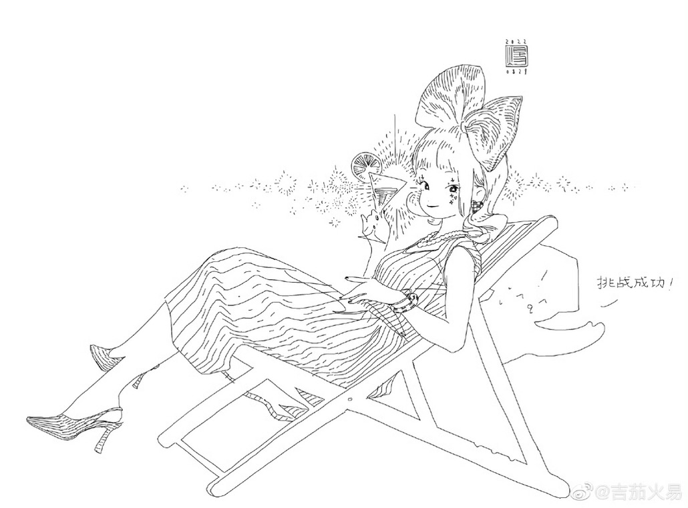
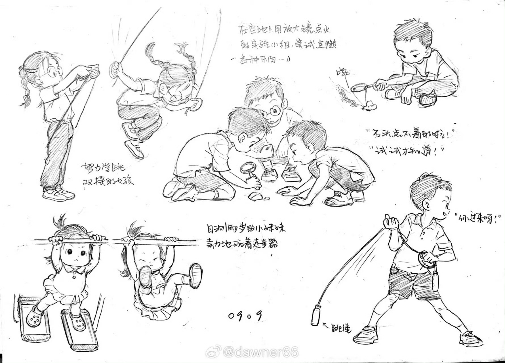
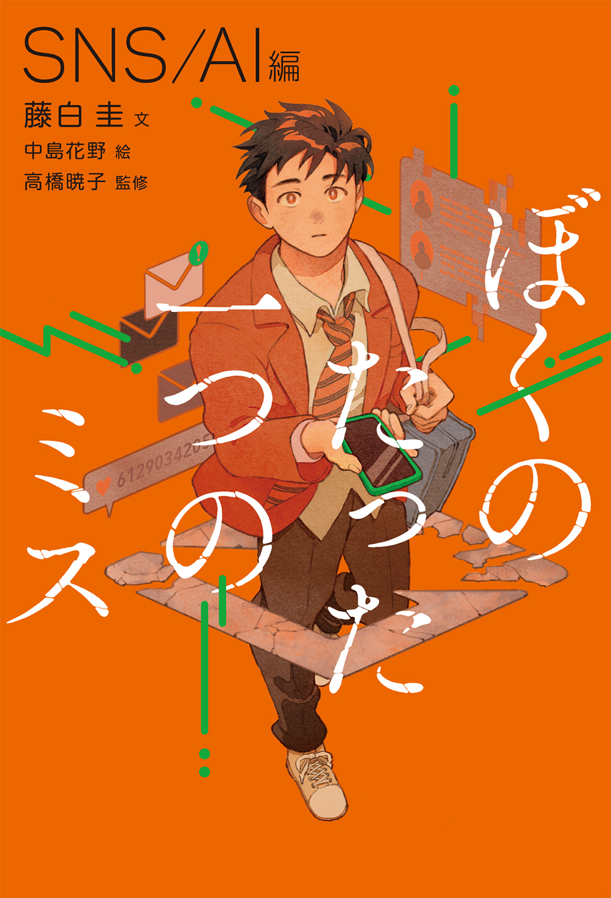
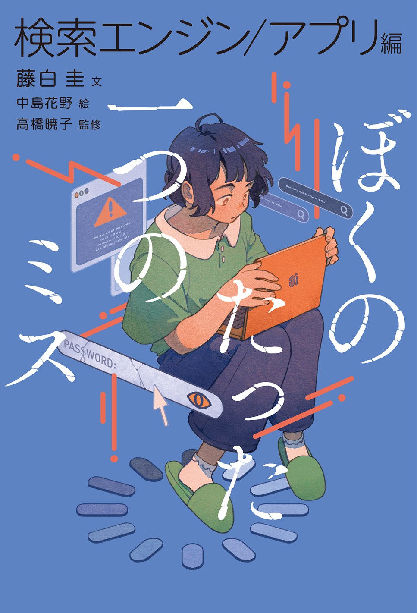
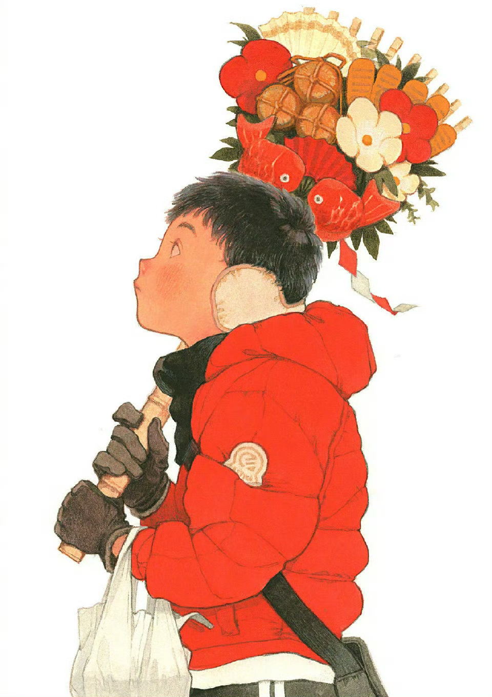
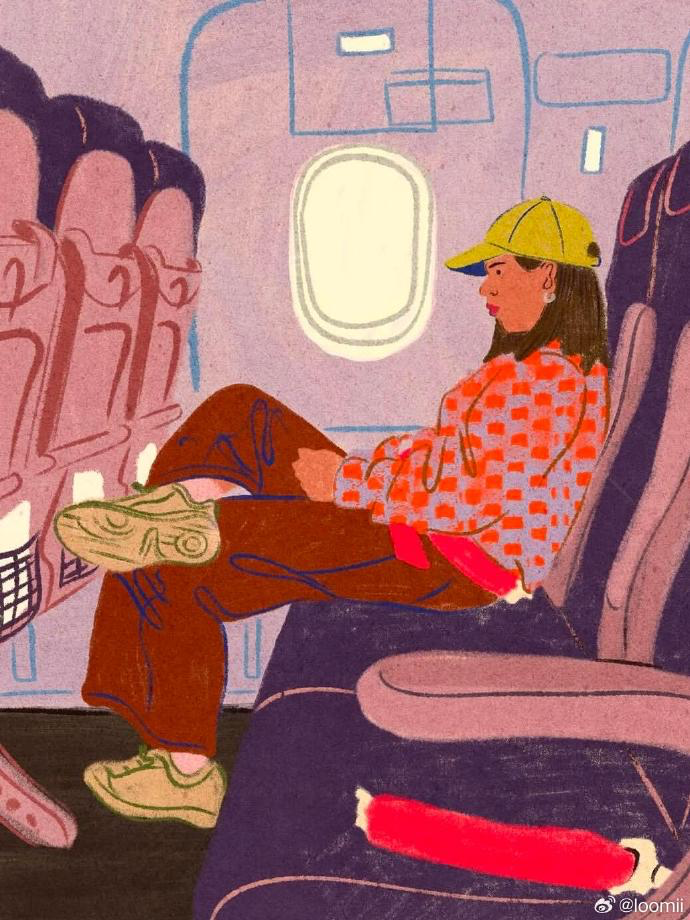
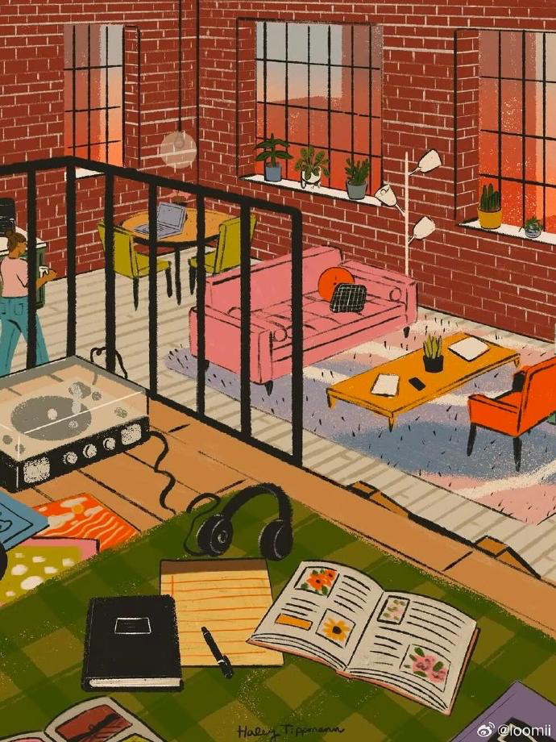
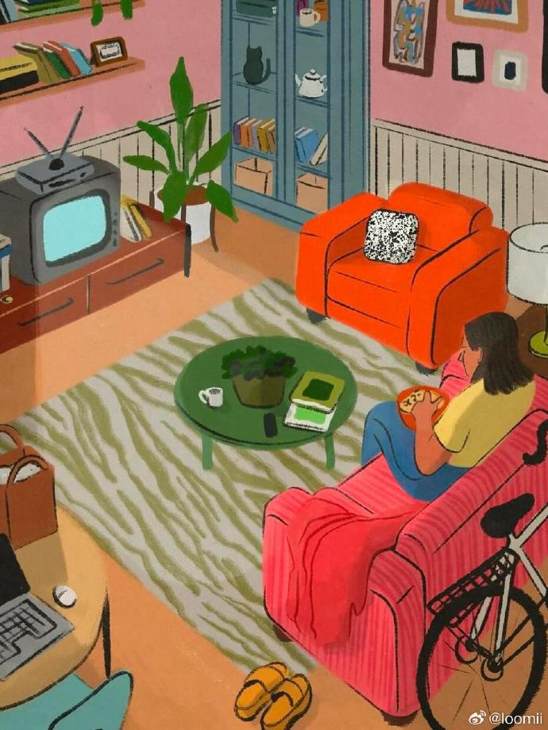

## JADDDDAN

韩国画师

构图中的故事感

## Alariko

推特和ig关注了的西班牙画师

配色很喜欢，是我最喜欢的中饱和

感觉会进入那个世界里待一会

## 吉茄火易

微博。干净准确有张力的线条，恰到好处的留白

女孩子的脸都很可爱，软乎乎的

## dawner66

非科班画师，本科医学，研究生动漫。有微博。

记录生活的瞬间和自己喷薄而出的感情，能让人感受到活力的速写，很向往

## 能溢出感情的画

看到一篇小红书，是一个博主在德国的一家古董店淘到了一个人画的明信片，记录了他一生的喜怒哀乐。不算厚的一沓纸，一个普通人的一生就流走了。很感动，但也有点哀愁。看画面内容，生活水平达到了中层以上，但明媚的青年时代过去后进入了平淡的工作（虽然汽车修理在当时应该算是高端工作了），依然是无限苦闷，依托浓烈的情感在活着，最后哀叹自己的衰老，“我看不见太阳了”。早年提到了朋友和妻子，但似乎后来也没有再提起。

倒是想画画了，想画富有感情的而不仅是好看的画。也觉得古董很有意思，怪不得很多人会沉迷古董。**时间在手中具象化了。**

[在德国淘到一个人的一生 - 小红书](https://www.xiaohongshu.com/explore/675ecaec00000000020374d1?app_platform=ios&app_version=8.63&share_from_user_hidden=true&xsec_source=app_share&type=video&xsec_token=CBspo_pvNRXCKY727utoCbnMUOXivIaqsQN-TTpLBrb3s=&author_share=1&xhsshare=WeixinSession&shareRedId=ODk6MjM7NU02NzUyOTgwNjdJOThKPkw8&apptime=1734399734&share_id=322195b3e844474888b1d1325b26296f)

链接看不到了，唉。

## 中岛花野

让人很安心的线条和颜色

而且感觉和自己有相似点

## **Haley Tippmann**

来自美国的德国插画师，有ig

咖啡厅、公共交通、和家里。觉得是个很安静的喜欢观察世界的人。

有所共鸣。

