## Python

### Plot

时间序列


函数定义时指定数据类型 `->`

```python
def validate_data(data: xr.Dataset) -> Tuple[xr.Dataset]:
```

### Torch

cuda信息

```python
torch.version.cuda
torch.__version__
torch.cuda.is_available()
torch.cuda.device_count()
torch.cuda.get_device_name()
torch.cuda.get_device_capability()
```


#### TIPS

pip安装的包conda remove删不掉

用全大写字母表示常量定义，小写字母表示变量，是一种约定俗成，来表示某些值应该被视为常量

fstring动态字符串，f"mask_{lev}"的结果是"mask_0"，在动态输出的时候经常用到

## CUDA

torch和cuda的匹配规则

- python和pytorch匹配矩阵：[Versioning Policy — PyTorch Lightning 2.5.1rc2 documentation](https://lightning.ai/docs/pytorch/latest/versioning.html#compatibility-matrix)
- pytorch和cuda匹配安装列表：[PyTorch](https://link.zhihu.com/?target=https%3A//pytorch.org/get-started/previous-versions/)

- pytorch自动生成匹配安装命令：[Get Started](https://pytorch.org/get-started/locally/)


安装cuda和cudnn

[非root用户安装cuda与cudnn - 知乎](https://zhuanlan.zhihu.com/p/198161777)

[CUDA Toolkit Archive | NVIDIA Developer](https://developer.nvidia.com/cuda-toolkit-archive)

[cuDNN Archive | NVIDIA Developer](https://developer.nvidia.com/rdp/cudnn-archive)

```bash
export CUDA_HOME=$CUDA_HOME:/home/qd_zlliu/cuda-12.1
export PATH="/public/home/jd_lulin/cuda-10.1/bin:$PATH"
export LD_LIBRARY_PATH=$LD_LIBRARY_PATH:/home/qd_zlliu/cuda-12.1/lib64
```

```bash
cp cudnn-linux-x86_64-8.9.7.29_cuda12-archive/include/cudnn*.h cuda-12.1/include/
cp cudnn-linux-x86_64-8.9.7.29_cuda12-archive/lib/libcudnn* cuda-12.1/lib64/
chmod a+r cuda-12.1/include/cudnn*.h cuda-12.1/lib64//libcudnn*
```


各服务器nvidia驱动和cuda版本

```bash
国实gpu1：550.54.15 12.4

gpu12：550.90.07 12.4

gpu15：515.105.01 11.7

gpu16：460.73.01 11.2

gpu17：535.104.12 12.2

gpu18：535.104.12 12.2
```


## LINUX

### 系统

连接GPU资源（需要用私钥

```bash
ssh -i ~/.ssh/id_rsa qd_zlliu@10.16.202.17 -p 22
ssh -i ~/.ssh/id_rsa qd_zlliu@10.16.202.18 -p 22
```

查看gpu

```bash
nvidia-smi
nvidia-smi -q | grep "Product Name"
```

实时监测gpu

```bash
watch -n 1 nvidia-smi 
```

查看硬件拓扑

```bash
nvidia-smi topo -m
```

查看cpu信息

```bash
lscpu
```

查看cpu内存

```bash
free -h
```

查看硬盘空间

```bash
df -h
```

查看当前磁盘使用情况

```bash
lfs quota h/home
```

查看目录大小

```bash
du -sh
```

终止进程

```bash
kill -15 <PID>  #优雅
kill -9 <PID> #强制
```

查看时区

```bash
cat /etc/timezone
```

Module

查看可用module

```bash
module avail
```

加载module

```bash
module load [name]
```

卸载module

集群上已安装docker


### 文件

新建目录

```bash
mkdir
```

转到目录

```bash
cd
```
删除目录

```bash
rmdir
```

复制文件

```bash
cp [source] [to]
```
同步文件

```bash
rsync -a [source] [to]
```

移动文件

```bash
mv [source] [to]
```

压缩目录

```bash
tar -czvf 输出文件名.tar.gz 要压缩的文件或目录
```

解压tar文件

```bash
tar -xzvf archive.tar.gz
tar -xJvf cudnn-linux-x86_64-8.9.7.29_cuda12-archive.tar.xz
```

显示所有文件和目录，包括隐藏

```bash
ls -a	
```
删除文件或目录，-r表示递归，-f表示强制删除
```bash
rm -r [file/dir]
```
修改用户配置文件
```bash
sudo gedit ~/.bashrc 	# 修改用户配置文件:/home/duriannut
source ~/.bashrc		# 修改完以后激活
```
显示环境变量
```bash
printenv
```
修改文件权限
```bash
chmod 777 file
chmod 644 file
```
解压文件
```bash
tar -C [dir] *.tar.gz
```

everything从本机传文件到虚拟机
```bash
wget [link] --user root --password 123123
```

setup.py安装

```bash
sudo python setup.py install
```

创建符号链接

```bash
ln -sf ~/datasets .datasets
```

查看符号链接路径

```bash
ls -l INPUT/ocean_hgrid.nc
```

### 脚本

bash循环语句使用方法：https://www.yiibai.com/bash/bash-for-loop.html

```bash
arr="100 200 300"
for i in $arr;do
echo $i
done
```

### vim

进入插入模式

```bash
i
```

退出插入模式

```bash
esc
```

保存并退出

```bash
:wq
```

## Docker

### 安装docker

课件地址：https://docker.easydoc.net
官方安装文档：https://docs.docker.com/engine/install/ubuntu/

卸载旧版本

```bash
for pkg in docker.io docker-doc docker-compose docker-compose-v2 podman-docker containerd runc; do sudo apt-get remove $pkg; done
```

更新apt库

```bash
# Add Docker's official GPG key:
sudo apt-get update
sudo apt-get install ca-certificates curl
sudo install -m 0755 -d /etc/apt/keyrings
sudo curl -fsSL https://download.docker.com/linux/ubuntu/gpg -o /etc/apt/keyrings/docker.asc
sudo chmod a+r /etc/apt/keyrings/docker.asc

# Add the repository to Apt sources:
echo \
  "deb [arch=$(dpkg --print-architecture) signed-by=/etc/apt/keyrings/docker.asc] https://download.docker.com/linux/ubuntu \
  $(. /etc/os-release && echo "${UBUNTU_CODENAME:-$VERSION_CODENAME}") stable" | \
  sudo tee /etc/apt/sources.list.d/docker.list > /dev/null
sudo apt-get update
```

安装docker包

```bash
sudo apt-get install docker-ce docker-ce-cli containerd.io docker-buildx-plugin docker-compose-plugin
sudo systemctl start docker
```

运行测试镜像hello-world，失败

```bash
sudo docker run hello-world
```

是因为网太差，需要更换镜像源，参考docker运行hello-world镜像失败：[Docker运行hello-world镜像失败或超时：Unable to find image ‘hello-world:latest‘ locally Trying to pull reposi_unable to find image 'hello-world:latest' locally-CSDN博客](https://blog.csdn.net/oyjl__/article/details/143522664)

```bash
sudo mkdir -p /etc/docker
sudo tee /etc/docker/daemon.json <<-'EOF'
{
    "registry-mirrors": [
        "https://do.nark.eu.org",
        "https://dc.j8.work",
        "https://docker.m.daocloud.io",
        "https://dockerproxy.com",
        "https://docker.mirrors.ustc.edu.cn",
        "https://docker.nju.edu.cn",
        "https://docker.1ms.run",
        "https://docker.xuanyuan.me"
        
    ]
}
EOF
sudo systemctl daemon-reload
sudo systemctl restart docker
systemctl status docker
```

再次运行sudo docker run hello-world，成功

### 编写Dockerfile

镜像源，可用[[docker\]nvidia的cuda镜像列表-CSDN博客](https://blog.csdn.net/FL1623863129/article/details/132275060)

```bash
sudo docker pull nvcr.io/nvidia/cuda:12.1.0-cudnn8-runtime-ubuntu22.04
```

参考[Ubuntu24.02使用Docker搭建CUDA12.2环境过程 - 金元宝骑骑 - 博客园](https://www.cnblogs.com/jinyuanbao/p/18451810)

Dockerfile：

```dockerfile
FROM nvcr.io/nvidia/cuda:12.1.0-cudnn8-runtime-ubuntu22.04

RUN apt-get update && apt-get install -y curl wget vim python3-pip

# 安装anaconda
RUN wget -P /tmp https://repo.anaconda.com/archive/Anaconda3-2024.10-1-Linux-x86_64.sh \
    && chmod +x /tmp/Anaconda3-2024.10-1-Linux-x86_64.sh \
    && sh /tmp/Anaconda3-2024.10-1-Linux-x86_64.sh -b -p /opt/anaconda3 \
    && rm /tmp/Anaconda3-2024.10-1-Linux-x86_64.sh

# conda设置
RUN conda config --set show_channel_urls yes \
 && conda config --set auto_activate_base no \
 && conda update conda -y && conda update --all \
 && conda init bash

WORKDIR /samudra
COPY ./environment.yml /samudra

 # 创建samudra环境
RUN conda env create -f environment.yml \
 && conda activate samudra \
 && cd /samudra

ENV TZ=Asia/Shanghai \
PATH=/opt/anaconda3/bin:$PATH

 #清楚临时文件和缓存
RUN apt-get clean && rm -rf /var/lib/apt/lists/* /tmp/* /var/tmp/*


EXPOSE 22
EXPOSE 6006
EXPOSE 8888

CMD ["bash"]
```

cd到Dockerfile（D大写）目录

创建镜像

```bash
sudo docker build -t samudra:latest .
```

这段时间根据报错不断调整Dockerfile，然后重来

*不要更换清华源，conda update反而变慢

查看所有镜像

```bash
sudo docker images
```

删除镜像

```bash
docker rmi <image>
```


### 使用容器

进入容器（未运行）

```bash
sudo docker run -it --name my-test-container my-image /bin/bash
```

进入容器（已运行）

```bash
sudo docker exec -it my-python-container /bin/bash
```

进入容器并添加挂载目录

```bash
sudo docker run -it --gpus all --name mycontainer -v /home/lzl/samudra/code:/workspace/code -v /home/lzl/samudra/data:/workspace/data samudra /bin/bash
```

查看所有容器

```bash
sudo docker ps -a
```

退出容器

```bash
sudo docker stop mycontainer
```

删除容器

```bash
sudo docker rm mycontainer
```

**[已解决] 容器无法识别gpu资源**

更新docker版本

```bash
sudo apt update
sudo apt upgrade docker-ce
sudo systemctl restart docker
```

安装nvidia容器工具

[Installing the NVIDIA Container Toolkit — NVIDIA Container Toolkit](https://docs.nvidia.com/datacenter/cloud-native/container-toolkit/latest/install-guide.html)

修改docker配置文件

```bash
sudo nvidia-ctk runtime configure --runtime=docker
```

重新启动

```bash
sudo systemctl restart docker
```

### 服务器使用镜像

导出镜像

```bash
sudo docker save -o samudra_image.tar samudra
```

载入镜像

```bash
docker load < samudra_img.tar
```

**[已解决]问题：服务器docker需要root权限**

尝试Udocker替代，功能不全，失败

联系管理员添加权限

查看用户组

```bash
grep docker /etc/group
```

问题：载入镜像报错

```bash
docker load < samudra_img.tar
open /var/lib/docker/tmp/docker-import-885058880/blobs/json: no such file or directory
```

换另一种方式仍然报错

```bash
cat samudra_img.tar | docker import - samudra_img
Error response from daemon: ApplyLayer exit status 1 stdout:  stderr: write /opt/anaconda3/envs/samudra/lib/python3.10/site-packages/torch/lib/libtorch_cuda.so: no space left on device
```

尝试减小镜像体积，只保留ubuntu环境

```bash
sudo docker build -t ubuntu_docker:latest .
```

导出镜像

```bash
sudo docker save -o ubuntu_docker.tar ubuntu_docker
```

**[已解决]问题：镜像文件无法通过xftp传输**

经检查为权限问题

```bash
ls -la
-rw------- 1 root root 3839890432 May 14 12:17 ubuntu_docker.tar
```

更改用户名和权限

```bash
sudo chown lzl:lzl ubuntu_docker.tar
chmod 644 ubuntu_docker.tar
```

载入镜像

```bash
docker load < ubuntu_docker.tar
```

运行容器，挂载anaconda，code，data，启动gpu

```bash
docker run -it --gpus all --name samudra -v /home/qd_zlliu/samudra/code:/samudra/code -v /home/qd_zlliu/samudra/data:/samudra/data -v /home/qd_zlliu/anaconda3:/samudra/anaconda3 ubuntu_docker /bin/bash
```

**[未解决]问题：docker run无gpu参数，nvidia-smi无法识别**

docker18以下无--gpu命令

参考：[如何在较旧版本的docker中使用gpu - 思念殇千寻 - 博客园](https://www.cnblogs.com/chester-cs/p/17857447.html)

```bash
nvidia-docker run -it --name samudra -v /home/qd_zlliu/samudra/code:/samudra/code -v /home/qd_zlliu/samudra/data:/samudra/data -v /home/qd_zlliu/anaconda3:/samudra/anaconda3 --device /dev/nvidia0:/dev/nvidia0 --device /dev/nvidia1:/dev/nvidia1 --device /dev/nvidia2:/dev/nvidia2 --device /dev/nvidia3:/dev/nvidia3 --device /dev/nvidia4:/dev/nvidia4 --device /dev/nvidia5:/dev/nvidia5 --device /dev/nvidia6:/dev/nvidia6 --device /dev/nvidia7:/dev/nvidia7 --device /dev/nvidiactl:/dev/nvidiactl --device /dev/nvidia-uvm:/dev/nvidia-uvm --device /dev/nvidia-uvm-tools:/dev/nvidia-uvm-tools -v nvidia_driver_535.104.12:/usr/local/nvidia:ro ubuntu_docker /bin/bash
```

找不到nvidia文件夹，作罢

## IDE

### WSL

**安装wsl**

wsl是windows subsystem for linux，win10以上自带内置虚拟机

```bash
wsl --install
```

注意需要连接vpn，否则极慢！


**联动vs code和wsl**

code内安装wsl插件

终端内`code .` 可直接打开界面


**配置anaconda**

```bash
wget -P ~ https://repo.anaconda.com/archive/Anaconda3-2024.10-1-Linux-x86_64.sh #获取最新版anaconda
bash ~/Anaconda3-2024.10-1-Linux-x86_64.sh #安装 一路选yes
conda create -n mypy python=3.11 anaconda #配置环境
conda activate mypy
```

给自己的环境命名为了**mypy**

**安装cursor**

[Cursor - The AI Code Editor](https://www.cursor.com/cn)
使用github账号登录

完全继承vs code所有插件和界面功能，可从vs code一键导入所有配置，**ide可直接用cursor** 

**vscode + copilot**

cursor存在访问隐患。有网络限制的情况下用vscode + copilot配合deepseek作为替代方案


**将wsl迁移出C盘**

wsl默认安装在C盘，持续使用终有一天会不幸

参考以下帖子和ds回答

[windows WSL2避坑指南 - 菩提树下的杨过 - 博客园](https://www.cnblogs.com/yjmyzz/p/wsl2-tutorial-1.html#:~:text=默认是安装在C盘的，随着虚拟机里软件越装越多，很快C盘的空间就吃紧了，而且比较坑的是，就算在虚拟机里把文件给删除了，空间也不会被释放。,解决方案： 默认位置类似：C%3AUsersAdministratorAppDataLocalPackagesCanonicalGroupLimited.Ubuntu22.04LTS_79rhkp1fndgscLocalStateext4.vhdx)

[windows wsl下使用Ubuntu，保存在其他盘中_wsl安装的ubuntu在哪里-CSDN博客](https://blog.csdn.net/whitepu/article/details/136177105)

```bash
# 查看发行版名称
wsl -l -v
# 关闭 WSL
wsl --shutdown
# 导出发行版
wsl --export Ubuntu D:\wsl_backup.tar
# 注销原发行版
wsl --unregister Ubuntu
# 导入到新位置
wsl --import Ubuntu D:\WSL\ D:\wsl_backup.tar --version 2
```

**remote-ssh**失败

vscode版本太新，远程服务器glib版本不够

需要vscode降级

### VS code

快捷键cmd+shift+P

全局搜索cmd+shift+F

launch.json文件必须放在.vscode下面

### Anaconda

安装Anaconda

```bash
wget -P ~ https://repo.anaconda.com/archive/Anaconda3-2024.10-1-Linux-x86_64.sh #获取最新版anaconda
bash ~/Anaconda3-2024.10-1-Linux-x86_64.sh #安装 一路选yes
```

更新conda包

```bash
conda update conda
conda update --all
```

查看环境列表

```bash
conda env list
```

创建环境

```bash
conda create -n mom6py jupyter xarray matplotlib numpy netcdf4

conda env create -f environment.yml
```

激活环境

```bash
conda activate mom6py
```

反激活环境

```bash
conda deactivate
```

移除环境

```bash
conda env remove --name samudra
```

克隆环境

```bash
conda create --name samudra_cu121 --clone samudra
```


## Github

**GitDiagram**

自动绘制项目框架图，将github换成gitdiagram

```bash
https://github.com/m2lines/samudra
https://gitdiagram.com/m2lines/samudra
```

### SSH

配置github SSH

新电脑第一次git clone前需要做的事情

```bash
ls ~/.ssh
```

如果没有id_rsa和id_rsa.pub文件

```bash
ssh-keygen -t rsa
cat ~/.ssh/id_rsa.pub
```

将内容复制到github新key中
检查是否连接成功

```bash
ssh -T git@github.com
```


设置全局身份

```bash
git config --global user.email "你的邮箱（如 GitHub 注册邮箱）"
git config --global user.name "name"
```


首次绑定？

```bash
git init
git remote add origin https://github.com/your-username/my-project.git
git add .
git commit -m "第一次提交"  # 创建初始提交
git push -u origin master
```
后续更新
```
git add .
git commit -m "更新内容"
git push
```

查看远程仓库

```bash
git remote -v
```

删除远程仓库

```bash
git remote remove origin
```


## HPC

超算 节点数 核数

https://top500.org/

美国 El Capitan 1.1万 1.1千万
https://www.llnl.gov/article/52061/lawrence-livermore-national-laboratorys-el-capitan-verified-worlds-fastest-supercomputer

美国 Frontier 9千 8百万
https://docs.olcf.ornl.gov/systems/frontier_user_guide.html

日本 Fugaku 15万 7百万
https://www.r-ccs.riken.jp/en/fugaku/about/

美国 Aurora 1万 1.1百万
https://www.tomshardware.com/tech-industry/supercomputers/aurora-supercomputer-is-now-fully-operational-available-to-researchers

微软Eagle 2百万

samudra结构图

```mermaid
flowchart TB
    %% External Data Sources
    subgraph "External Data Sources"
        OM4_Zarr["OM4 Zarr Datasets"]:::external
        OM4_Stats["OM4 Statistics"]:::external
    end
%% Configuration Management
subgraph "Configuration Management"
    ConfigTrain["train_samudra_om4.yaml"]:::config
    ConfigRollout["rollout_samudra_om4.yaml"]:::config
    ConfigParser["config.py"]:::config
end

%% Data Ingestion & Preprocessing
subgraph "Data Ingestion & Preprocessing"
    Datasets["datasets.py"]:::data
    DataUtils["utils/data.py"]:::data
    Normalization["Normalization\n(means/stds)"]:::data
end

%% Model Definition
subgraph "Model Definition"
    Activations["activations.py"]:::model
    Blocks["blocks.py"]:::model
    Factory["factory.py"]:::model
    SamudraCore["samudra.py"]:::model
end

%% Training Orchestration
subgraph "Training Orchestration"
    TrainScript["train.py"]:::compute
    StepperTrain["stepper.py"]:::compute
    TrainUtils["utils/train.py"]:::compute
    Dist["utils/distributed.py"]:::compute
    Writer["utils/writer.py"]:::compute
end

%% Rollout / Inference
subgraph "Rollout / Inference"
    RolloutScript["rollout.py"]:::compute
    StepperRollout["stepper.py"]:::compute
end

%% Utilities
subgraph "Utilities"
    Logging["logging.py"]:::utils
    Device["device.py"]:::utils
    NotebookUtil["notebook.py"]:::utils
end

%% Visualization & Analysis
subgraph "Visualization & Analysis"
    Notebook["samudra_plotting.ipynb"]:::viz
    Assets["assets"]:::viz
end

%% Connections
ConfigTrain --> ConfigParser
ConfigRollout --> ConfigParser
ConfigParser --> TrainScript
ConfigParser --> RolloutScript

OM4_Zarr --> Datasets
OM4_Stats --> Normalization
Datasets --> Normalization
Normalization -->|"PyTorch Tensor"| TrainScript
Normalization -->|"PyTorch Tensor"| RolloutScript

TrainScript --> StepperTrain
RolloutScript --> StepperRollout

StepperTrain --> SamudraCore
StepperRollout --> SamudraCore

Activations --> Factory
Blocks --> Factory
Factory --> SamudraCore

TrainScript --> TrainUtils
TrainScript --> Dist
TrainScript --> Writer
TrainScript --> Logging
TrainScript --> Device

RolloutScript --> Logging
RolloutScript --> Device

Writer --> Assets
Notebook --> Assets
Notebook --> NotebookUtil

%% Click Events
click ConfigTrain "https://github.com/m2lines/samudra/blob/main/configs/train_samudra_om4.yaml"
click ConfigRollout "https://github.com/m2lines/samudra/blob/main/configs/rollout_samudra_om4.yaml"
click ConfigParser "https://github.com/m2lines/samudra/blob/main/src/config.py"
click Datasets "https://github.com/m2lines/samudra/blob/main/src/datasets.py"
click DataUtils "https://github.com/m2lines/samudra/blob/main/src/utils/data.py"
click Activations "https://github.com/m2lines/samudra/blob/main/src/models/activations.py"
click Blocks "https://github.com/m2lines/samudra/blob/main/src/models/blocks.py"
click Factory "https://github.com/m2lines/samudra/blob/main/src/models/factory.py"
click SamudraCore "https://github.com/m2lines/samudra/blob/main/src/models/samudra.py"
click TrainScript "https://github.com/m2lines/samudra/blob/main/src/train.py"
click StepperTrain "https://github.com/m2lines/samudra/blob/main/src/stepper.py"
click TrainUtils "https://github.com/m2lines/samudra/blob/main/src/utils/train.py"
click Dist "https://github.com/m2lines/samudra/blob/main/src/utils/distributed.py"
click Writer "https://github.com/m2lines/samudra/blob/main/src/utils/writer.py"
click RolloutScript "https://github.com/m2lines/samudra/blob/main/src/rollout.py"
click Logging "https://github.com/m2lines/samudra/blob/main/src/utils/logging.py"
click Device "https://github.com/m2lines/samudra/blob/main/src/utils/device.py"
click NotebookUtil "https://github.com/m2lines/samudra/blob/main/src/utils/notebook.py"
click Notebook "https://github.com/m2lines/samudra/blob/main/notebooks/samudra_plotting.ipynb"
click Assets "https://github.com/m2lines/samudra/tree/main/assets/"

%% Styles
classDef external fill:#bbdefb,stroke:#333,stroke-width:1px
classDef config fill:#fff59d,stroke:#333,stroke-width:1px
classDef data fill:#b3e5fc,stroke:#333,stroke-width:1px
classDef model fill:#c8e6c9,stroke:#333,stroke-width:1px
classDef compute fill:#a5d6a7,stroke:#333,stroke-width:1px
classDef utils fill:#eeeeee,stroke:#333,stroke-width:1px
classDef viz fill:#ffe0b2,stroke:#333,stroke-width:1px
```





aurora结构图

```mermaid
flowchart TD
    %% External Dependencies
    subgraph "External Services" 
        direction TB
        PyTorch["PyTorch"]:::external
        MLflowServer["MLflow Server"]:::external
        FoundryCloud["Palantir Foundry"]:::external
    end

    %% Data Layer
    subgraph "Data Preprocessor" 
        direction TB
        Batch["Batch"]:::core
        Area["area.py"]:::core
        Normalisation["normalisation.py"]:::core
    end

    %% Model Layer
    subgraph "Aurora Model" 
        direction TB
        Encoder["encoder.py"]:::core
        Decoder["decoder.py"]:::core
        Fourier["fourier.py"]:::core
        LoRA["lora.py"]:::core
        CoreModel["aurora.py"]:::core
        Utils["Other Layers & Utils"]:::core
    end

    %% Inference Layer
    subgraph "Inference & Rollout"
        direction TB
        Rollout["rollout.py"]:::core
        Tracker["tracker.py"]:::core
    end

    %% Integration Layer
    subgraph "Foundry Integration"
        direction TB
        subgraph "Client" 
            direction TB
            FAPI["api.py"]:::integration
            FClient["foundry.py"]:::integration
            Channel["common/channel.py"]:::integration
            FModel["common/model.py"]:::integration
            Demo["demo/"]:::integration
        end
        subgraph "Server & MLflow Plugin"
            direction TB
            MLWrapper["mlflow_wrapper.py"]:::integration
            MLPlugin["package_mlflow.py"]:::integration
        end
    end

    %% Documentation & Examples
    Docs["docs/"]:::docs

    %% CI/CD & Publishing
    subgraph "CI/CD & Publishing"
        direction TB
        CI[".github/workflows/ci.yaml"]:::ci
        DocsBuild[".github/workflows/build_docs.yaml"]:::ci
        Format[".github/workflows/formatting.yaml"]:::ci
        Publish[".github/workflows/publish.yaml"]:::ci
        Makefile["Makefile"]:::ci
    end

    %% Testing
    Tests["tests/"]:::tests

    %% Data Flow & Control Flow
    User["User Script"]:::actor
    User -->|"instantiate Batch/Metadata"| Batch
    User -->|"instantiate Batch/Metadata"| Area
    User -->|"instantiate Batch/Metadata"| Normalisation
    Batch -->|"processed data"| CoreModel
    Area -->|"area data"| CoreModel
    Normalisation -->|"normalized data"| CoreModel
    CoreModel -->|"Prediction"| Rollout
    Rollout -->|"time-series steps"| Tracker
    Tracker -->|"MLflow log"| MLflowServer
    MLPlugin -->|"wraps model"| CoreModel
    MLWrapper -->|"logs via MLflow"| MLflowServer

    %% Integration Flows
    FAPI -->|"calls"| MLWrapper
    FClient -->|"submits job"| FoundryCloud
    FoundryCloud -->|"invokes"| MLWrapper
    MLWrapper -->|"executes model"| CoreModel

    %% CI/CD & Docs & Tests
    CI -->|runs| Tests
    CI -->|builds| Docs
    CI -->|formats| CoreModel
    CI -->|publishes| MLPlugin

    %% Dependencies
    CoreModel --> PyTorch
    MLWrapper --> MLflowServer
    FClient --> FoundryCloud

    %% Click Events
    click Batch "https://github.com/microsoft/aurora/blob/main/aurora/batch.py"
    click Area "https://github.com/microsoft/aurora/blob/main/aurora/area.py"
    click Normalisation "https://github.com/microsoft/aurora/blob/main/aurora/normalisation.py"
    click Encoder "https://github.com/microsoft/aurora/blob/main/aurora/model/encoder.py"
    click Decoder "https://github.com/microsoft/aurora/blob/main/aurora/model/decoder.py"
    click Fourier "https://github.com/microsoft/aurora/blob/main/aurora/model/fourier.py"
    click LoRA "https://github.com/microsoft/aurora/blob/main/aurora/model/lora.py"
    click CoreModel "https://github.com/microsoft/aurora/blob/main/aurora/model/aurora.py"
    click Rollout "https://github.com/microsoft/aurora/blob/main/aurora/rollout.py"
    click Tracker "https://github.com/microsoft/aurora/blob/main/aurora/tracker.py"
    click FAPI "https://github.com/microsoft/aurora/blob/main/aurora/foundry/client/api.py"
    click FClient "https://github.com/microsoft/aurora/blob/main/aurora/foundry/client/foundry.py"
    click Channel "https://github.com/microsoft/aurora/blob/main/aurora/foundry/common/channel.py"
    click FModel "https://github.com/microsoft/aurora/blob/main/aurora/foundry/common/model.py"
    click Demo "https://github.com/microsoft/aurora/tree/main/aurora/foundry/demo/"
    click MLWrapper "https://github.com/microsoft/aurora/blob/main/aurora/foundry/server/mlflow_wrapper.py"
    click MLPlugin "https://github.com/microsoft/aurora/blob/main/package_mlflow.py"
    click Docs "https://github.com/microsoft/aurora/tree/main/docs/"
    click CI "https://github.com/microsoft/aurora/blob/main/.github/workflows/ci.yaml"
    click DocsBuild "https://github.com/microsoft/aurora/blob/main/.github/workflows/build_docs.yaml"
    click Format "https://github.com/microsoft/aurora/blob/main/.github/workflows/formatting.yaml"
    click Publish "https://github.com/microsoft/aurora/blob/main/.github/workflows/publish.yaml"
    click Makefile "https://github.com/microsoft/aurora/tree/main/Makefile"
    click Tests "https://github.com/microsoft/aurora/tree/main/tests/"

    %% Styles
    classDef core fill:#cce5ff,stroke:#339,stroke-width:1px
    classDef integration fill:#d4edda,stroke:#2a6b2d,stroke-width:1px
    classDef external fill:#ffe5b4,stroke:#cc8400,stroke-width:1px
    classDef docs fill:#f0e6ff,stroke:#8033a0,stroke-width:1px
    classDef ci fill:#ffe6e6,stroke:#cc0000,stroke-width:1px
    classDef tests fill:#e6ffe6,stroke:#00cc44,stroke-width:1px
    classDef actor fill:#ffffff,stroke:#000000,stroke-width:1px,stroke-dasharray: 2 2
```



graphcast结构图

```mermaid
flowchart TB
    %% External Systems
    ECMWFZ["ECMWF Zarr Endpoints"]:::ext
    GCS["Google Cloud Storage"]:::ext

    %% Data Layer
    subgraph "Data Layer"
        DU["data_utils.py"]:::data
        NORM["normalization.py"]:::data
        CLEAN["nan_cleaning.py"]:::data
        XJAX["xarray_jax.py"]:::data
        XTREE["xarray_tree.py"]:::data
    end

    %% Graph Layer
    subgraph "Graph Layer"
        IM["icosahedral_mesh.py"]:::data
        GMC["grid_mesh_connectivity.py"]:::data
        TG["typed_graph.py"]:::data
        MU["model_utils.py"]:::data
    end

    %% Model Layer
    subgraph "Model Layer"
        subgraph "GraphCast Core Model"
            GC["graphcast.py"]:::core
            CAST["casting.py"]:::core
            SOL["solar_radiation.py"]:::core
        end
        subgraph "GenCast Core Model"
            GC2["gencast.py"]:::core
            DEN["denoiser.py"]:::core
            DB["denoisers_base.py"]:::core
            DPS["dpm_solver_plus_plus_2s.py"]:::core
        end
        subgraph "Common Building Blocks"
            DTGN["deep_typed_graph_net.py"]:::data
            TGN["typed_graph_net.py"]:::data
            MLP["mlp.py"]:::data
            TRANS["transformer.py"]:::data
            SPARSE["sparse_transformer.py"]:::data
            SPUTIL["sparse_transformer_utils.py"]:::data
        end
    end

    %% Runtime Layer
    subgraph "Runtime Layer"
        AR["autoregressive.py"]:::runtime
        RO["rollout.py"]:::runtime
        PB["predictor_base.py"]:::runtime
        SB["samplers_base.py"]:::runtime
        SU["samplers_utils.py"]:::runtime
        CKPT["checkpoint.py"]:::runtime
        LOSS["losses.py"]:::runtime
    end

    %% Demos & Notebooks
    subgraph "Demos & Notebooks"
        D1["gencast_demo.ipynb"]:::demo
        D2["gencast_demo_cloud_vm.ipynb"]:::demo
        D3["gencast_mini_demo.ipynb"]:::demo
        D4["graphcast_demo.ipynb"]:::demo
    end

    %% Data Flow
    ECMWFZ --> DU
    GCS --> DU
    DU --> IM
    DU --> NORM
    DU --> CLEAN
    DU --> XJAX
    DU --> XTREE
    IM --> TG
    GMC --> TG
    TG --> GC
    TG --> GC2
    DTGN --> GC
    TGN --> GC
    MLP --> GC
    TRANS --> GC
    SPARSE --> GC
    SPUTIL --> GC
    DTGN --> GC2
    TGN --> GC2
    MLP --> GC2
    TRANS --> GC2
    SPARSE --> GC2
    SPUTIL --> GC2
    GC --> AR
    CAST --> AR
    SOL --> AR
    GC2 --> AR
    DEN --> AR
    DB --> AR
    DPS --> AR
    AR --> LOSS
    LOSS --> CKPT
    CKPT --> AR
    AR --> RO
    RO --> GCS
    RO --> D1
    RO --> D2
    RO --> D3
    RO --> D4

    %% Click Events
    click DU "https://github.com/google-deepmind/graphcast/blob/main/graphcast/data_utils.py"
    click NORM "https://github.com/google-deepmind/graphcast/blob/main/graphcast/normalization.py"
    click CLEAN "https://github.com/google-deepmind/graphcast/blob/main/graphcast/nan_cleaning.py"
    click XJAX "https://github.com/google-deepmind/graphcast/blob/main/graphcast/xarray_jax.py"
    click XTREE "https://github.com/google-deepmind/graphcast/blob/main/graphcast/xarray_tree.py"
    click IM "https://github.com/google-deepmind/graphcast/blob/main/graphcast/icosahedral_mesh.py"
    click GMC "https://github.com/google-deepmind/graphcast/blob/main/graphcast/grid_mesh_connectivity.py"
    click TG "https://github.com/google-deepmind/graphcast/blob/main/graphcast/typed_graph.py"
    click MU "https://github.com/google-deepmind/graphcast/blob/main/graphcast/model_utils.py"
    click GC "https://github.com/google-deepmind/graphcast/blob/main/graphcast/graphcast.py"
    click CAST "https://github.com/google-deepmind/graphcast/blob/main/graphcast/casting.py"
    click SOL "https://github.com/google-deepmind/graphcast/blob/main/graphcast/solar_radiation.py"
    click GC2 "https://github.com/google-deepmind/graphcast/blob/main/graphcast/gencast.py"
    click DEN "https://github.com/google-deepmind/graphcast/blob/main/graphcast/denoiser.py"
    click DB "https://github.com/google-deepmind/graphcast/blob/main/graphcast/denoisers_base.py"
    click DPS "https://github.com/google-deepmind/graphcast/blob/main/graphcast/dpm_solver_plus_plus_2s.py"
    click DTGN "https://github.com/google-deepmind/graphcast/blob/main/graphcast/deep_typed_graph_net.py"
    click TGN "https://github.com/google-deepmind/graphcast/blob/main/graphcast/typed_graph_net.py"
    click MLP "https://github.com/google-deepmind/graphcast/blob/main/graphcast/mlp.py"
    click TRANS "https://github.com/google-deepmind/graphcast/blob/main/graphcast/transformer.py"
    click SPARSE "https://github.com/google-deepmind/graphcast/blob/main/graphcast/sparse_transformer.py"
    click SPUTIL "https://github.com/google-deepmind/graphcast/blob/main/graphcast/sparse_transformer_utils.py"
    click AR "https://github.com/google-deepmind/graphcast/blob/main/graphcast/autoregressive.py"
    click RO "https://github.com/google-deepmind/graphcast/blob/main/graphcast/rollout.py"
    click PB "https://github.com/google-deepmind/graphcast/blob/main/graphcast/predictor_base.py"
    click SB "https://github.com/google-deepmind/graphcast/blob/main/graphcast/samplers_base.py"
    click SU "https://github.com/google-deepmind/graphcast/blob/main/graphcast/samplers_utils.py"
    click CKPT "https://github.com/google-deepmind/graphcast/blob/main/graphcast/checkpoint.py"
    click LOSS "https://github.com/google-deepmind/graphcast/blob/main/graphcast/losses.py"

    %% Styles
    classDef data fill:#E0F7FA,stroke:#00838F,color:#004D40
    classDef core fill:#C8E6C9,stroke:#2E7D32,color:#1B5E20
    classDef runtime fill:#FFE0B2,stroke:#EF6C00,color:#E65100
    classDef ext fill:#ECEFF1,stroke:#90A4AE,color:#607D8B
    classDef demo fill:#F3E5F5,stroke:#8E24AA,color:#4A148C
```



